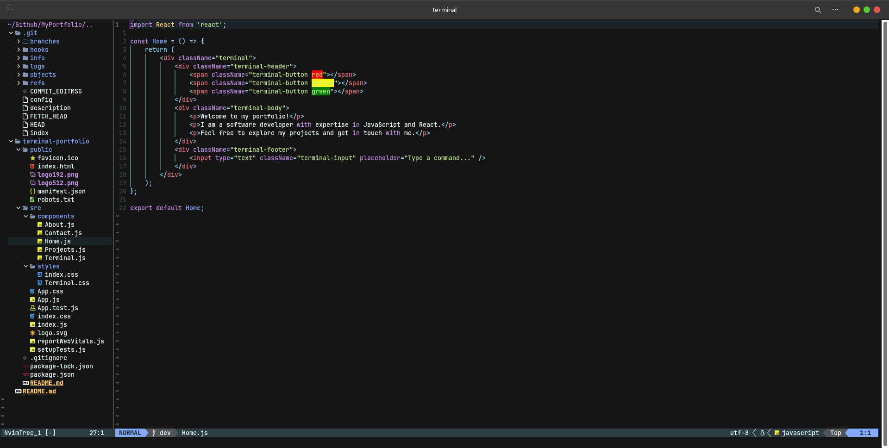
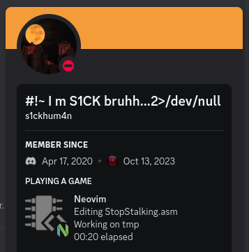
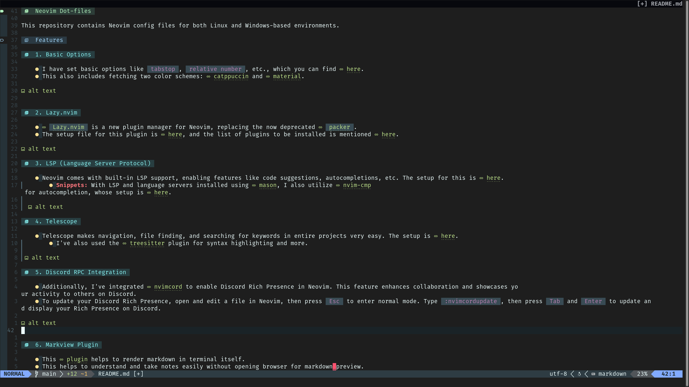

# Neovim Dot-files

This repository contains Neovim config files for both Linux and Windows-based environments. 

## Features

### 1. Basic Options

- I have set basic options like `tabstop`, `relative number`, etc., which you can find [here](lua/options.lua).
- This also includes fetching two color schemes: [catppuccin](https://github.com/catppuccin/nvim) and [material](https://github.com/kaicataldo/material.vim/).




### 2. Lazy.nvim

- [`Lazy.nvim`](https://github.com/folke/lazy.nvim) is a new plugin manager for Neovim, replacing the now deprecated [`packer`](https://github.com/wbthomason/packer.nvim).
- The setup file for this plugin is [here](lua/plugin.lua), and the list of plugins to be installed is mentioned [here](lua/pluginlist.lua).


### 3. LSP (Language Server Protocol)

- Neovim comes with built-in LSP support, enabling features like code suggestions, autocompletions, etc. The setup for this is [here](after/plugin/lsp.lua).
  - **Snippets:** With LSP and language servers installed using [mason](https://github.com/williamboman/mason.nvim), I also utilize [nvim-cmp](https://github.com/hrsh7th/nvim-cmp) for autocompletion, whose setup is [here](after/plugin/cmp.lua).

  

### 4. Telescope

- Telescope makes navigation, file finding, and searching for keywords in entire projects very easy. The setup is [here](after/plugin/telescope.lua).
  - I've also used the [treesitter](https://github.com/nvim-treesitter/nvim-treesitter) plugin for syntax highlighting and more.

 

### 5. Discord RPC Integration

- Additionally, I've integrated [nvimcord](https://github.com/ObserverOfTime/nvimcord) to enable Discord Rich Presence in Neovim. This feature enhances collaboration and showcases your activity to others on Discord.
- To update your Discord Rich Presence, open and edit a file in Neovim, then press `Esc` to enter normal mode. Type `:nvimcordupdate`, then press `Tab` and `Enter` to update and display your Rich Presence on Discord.




### 6. Markview Plugin

- This [plugin](https://github.com/OXY2DEV/markview.nvim) helps to render markdown in terminal itself.
- This helps to understand and take notes easily without opening browser for markdown_preview.




### 7. Notes and Notification

- Some custom files have been added to `after/plugin` that help in linking and taking notes easily.

- [keymaps.lua](./after/plugin/keymaps.lua) has been updated accordinly along with one more file being added.

- Notification features added using [notify.nvim](https://github.com/rcarriga/nvim-notify)


<br>
<br>
<br>

## Background

- The background is removed by default. If you want to enjoy your Neovim with a background, simply comment out line 29 [here](lua/options.lua).

---

## Installation

- Ensure you have Neovim `v0.8.0` or higher:

  ```bash
   nvim --version
- Ensure you have `NVIM  > v0.8.0`

- Install `ripgrep` and `yarn`
<br>

  - Linux

     ```bash
     apt install ripgrep  # debian based
     pacman -S ripgrep    # Arch


     # Baki dekhlo apna apna

     ```
  <br>

  - Windows

     ```cmd
     scoop install ripgrep
     ```

     or

     Refer this: [ripgrep](https://stackoverflow.com/questions/76666894/how-to-install-ripgrep-on-windows)

     <br>

     - Common

     ```bash

     npm i yarn -g #universal

     ```

<br>
<br>

- Make sure you have [node](https://nodejs.org/en) and [npm](https://www.npmjs.com/package/npm) installed.

- ensure presence of [`git`](https://github.com/git-guides/install-git) in the cmd.


- [git](https://git-scm.com/downloads) should be installed.
<br>

### Linux

<br>
1. Clone this repo in `.config/nvim`. Create it if not already there with `mkdir .config/nvim`.

<br>

```bash
mkdir ~/.config/nvim
cd ~/.config/nvim
git clone  "https://github.com/hail0hydra/gardua_nvim_dotfs" .
```
<br>

 2. Run nvim

<br>

```bash
nvim
```
<br>

### Windows
<br>

- Make sure you have [make](https://stackoverflow.com/questions/32127524/how-to-install-and-use-make-in-windows) and [gcc](https://gcc.gnu.org/install/binaries.html) installed.
- ensure [fzf](https://github.com/junegunn/fzf?tab=readme-ov-file#windows) is installed as well
  ```cmd
  scoop install gcc make fzf
  ```
<br>

1. Navigate to `%USERPROFILE%\AppData\Local\` and ensure the presence of `nvim` directory (not to be confused with `nvim-data` directory).

<br>

```cmd
cd "%USERPROFILE%\AppData\Local\"
```

<br>

2. If `nvim` directory isn't there make it and navigate into it

<br>

```cmd
mkdir nvim
cd nvim
```

<br>
3. Clone the github repo.

<br>

```cmd
git clone "https://github.com/hail0hydra/gardua_nvim_dotfs" .
```
<br>
4. Run nvim

<br>

```cmd
nvim
```
---

## Bonus

<br>

- To use dicord presence as in vscode, just go [here](./after/plugin/discord.lua) and uncomment the file. Make sure discord is on before opening nvim.

<br>

- To use [Markdown Preview](https://github.com/iamcco/markdown-preview.nvim) you can run `:call mkdp#util#install()` in any file just once.

- This function is already mapped to `<F5>`.
